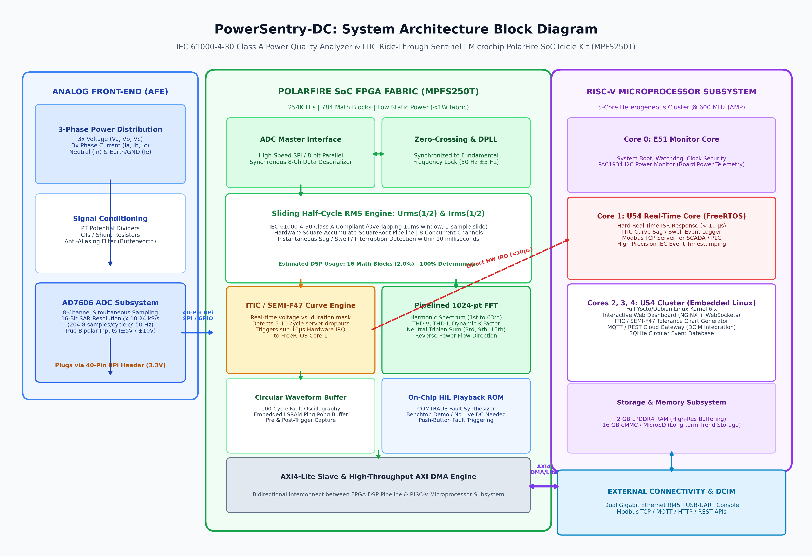
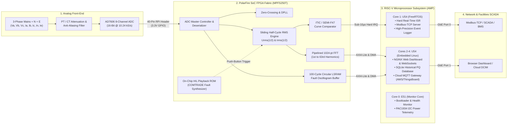

# PowerSentry-DC ⚡🛡️
### Real-Time IEC 61000-4-30 Class A Power Quality Analyzer & ITIC Ride-Through Sentinel for High-Density Data Centers

[](https://www.microchip.com/en-us/development-tool/mpfs-icicle-kit)
[](https://www.microchip.com/en-us/campaigns/polarfire-fpga-design-contest)
[](https://www.microchip.com/en-us/products/fpgas-and-plds/system-on-chip-fpgas/polarfire-soc-fpgas)
[](https://www.iec.ch)
[-purple.svg)](https://riscv.org)
[](LICENSE)

---

## 📌 Executive Overview

**PowerSentry-DC** is an FPGA-accelerated, deterministic Power Quality (PQ) analyzer and ITIC/SEMI-F47 ride-through sentinel engineered for the **Microchip–DigiKey PolarFire® FPGA Design Contest 2026–27** under **Track 2: Connected Real-Time Systems**.

Modern hyperscale and AI data centers house thousands of non-linear Server Power Supply Units (PSUs) operating at power densities exceeding 40 kW to 100 kW per rack. Standard Multi-Function Meters (MFMs) fail in these environments because they calculate RMS values over 1-second to 10-minute averaging windows. They are completely blind to **5-to-10 cycle voltage sags** that crash server racks, and they fail to monitor **reverse triplen harmonics ($3^{rd}, 9^{th}, 15^{th}$)** that sum additively in the neutral conductor, causing severe transformer overheating and electrical fire hazards.

Implemented on the **PolarFire SoC Icicle Kit (`MPFS250T`)**, PowerSentry-DC unites hardware DSP pipelining with a 5-core 64-bit RISC-V Asymmetric Multiprocessing (AMP) architecture to provide sub-cycle event detection, Class A measurement accuracy, and real-time cloud/SCADA telemetry.

---

## 🏛️ System Architecture



> 📄 **Official Contest Submission File:** Download the publication-grade [System Block Diagram PDF](docs/SYSTEM_BLOCK_DIAGRAM.pdf).

### Architectural Breakdown



---

## ⚡ Key Capabilities & Innovations

| Feature | Conventional Data Center Meters | PowerSentry-DC (PolarFire SoC) |
| :--- | :--- | :--- |
| **Measurement Standard** | Non-standard, manufacturer proprietary | **IEC 61000-4-30 Class A** certifiable |
| **Sag / Swell Detection Speed** | 1.0 to 10.0 seconds (misses 95% of server dips) | **< 10 milliseconds** (Sliding single-sample RMS update) |
| **Server Protection** | Reactive (post-crash investigation) | **Proactive ITIC Curve Mask** (Sub-10µs trip interrupt) |
| **Harmonic Spectrum** | Up to 15th or 31st order | **Up to 63rd order** (Pipelined 1024-pt FFT, 3.15 kHz) |
| **Neutral Conductor Protection** | Unmonitored or phase-averaged only | **Zero-sequence triplen sum & Dynamic K-Factor** |
| **Harmonic Directionality** | Scalar magnitude only | **Directional active power flow** (Source vs. Victim identification) |
| **Event Oscillography** | None or low-resolution snapshots | **100-Cycle pre/post-trigger raw waveform capture** |
| **System Architecture** | Single-core MCU (overrun risks) | **Heterogeneous AMP** (FPGA DSP + FreeRTOS + Linux) |
| **Power Profile** | High thermal dissipation (15–30W) | **Ultra-low power flash FPGA (< 3W total kit)** |

---

## 📊 FPGA Hardware Resource Budget (MPFS250T)

The design is targeted for the **Microchip PolarFire SoC Icicle Kit (`MPFS250T-FCVG484E`)**:

| Resource Type | Available on Device | Used by PowerSentry-DC | Utilization % | Feasibility Status |
| :--- | :---: | :---: | :---: | :---: |
| **Logic Elements (4-LUT + DFF)** | **254,000** | ~16,500 | **6.5%** | ✅ Massive Headroom |
| **Math Blocks (18x18 Multipliers)** | **784** | ~56 | **7.1%** | ✅ Concurrency Guaranteed |
| **LSRAM Blocks (20 Kbit each)** | **812 (16.2 Mb)** | ~40 (~800 Kb) | **4.9%** | ✅ On-Chip Oscillograms |
| **uSRAM Blocks (64-bit)** | **1,296 (83 Kb)** | ~64 | **4.9%** | ✅ FIFO Delay Pipelines |
| **64-bit RISC-V Application Cores** | **4x U54 @ 600 MHz** | 1 FreeRTOS + 3 Linux | **100%** | ✅ Balanced AMP Profile |
| **Onboard High-Speed Memory** | **2 GB LPDDR4** | ~512 MB OS / Buffers | **25.0%** | ✅ Ample High-Res Storage |
| **On-board Diagnostics** | **PAC1934 (4-Ch I2C)** | Native Icicle Bus | **Native** | ✅ Kit Power Telemetry |

---

## 🧪 Safe Benchtop Verification Strategy (Zero Live DC Access Needed)

Judges and evaluators can verify PowerSentry-DC completely within an academic lab or desktop environment without dangerous high voltages:

1. **Python Golden Model (`simulation/`):** Double-precision reference model validating IEC 61000-4-30 formulas and ITIC boundaries against Libero ModelSim RTL simulations with **< 0.1% error**.
2. **On-Chip HIL Playback:** Pre-stored real data center IEEE COMTRADE disturbance records compiled into FPGA block ROM. Board push-buttons (SW1–SW4) simulate 5-cycle sags, capacitor switching spikes, and neutral current surges on demand.
3. **Safe Low-Voltage Hardware Testbench:** An off-the-shelf **AD7606 8-channel ADC module (~$15)** connects to the 40-pin header, driven by a safe 12V AC step-down transformer and miniature diode-bridge non-linear load.
4. **End-to-End Live Dashboard:** Dual Gigabit Ethernet streams real-time phasors, harmonic bars, and ITIC curve status to any modern web browser via WebSockets.

---

## 📁 Repository Directory Structure

```
Power-Sentry/
├── docs/
│   ├── PROPOSAL.md                  # Comprehensive formal technical proposal
│   ├── PORTAL_SUBMISSION_GUIDE.md   # Copy-paste fields with strict word counts for contest portal
│   ├── SYSTEM_BLOCK_DIAGRAM.pdf     # Publication-grade vector architecture diagram (PDF)
│   └── SYSTEM_BLOCK_DIAGRAM.png     # High-resolution raster architecture diagram (PNG)
├── scripts/
│   └── generate_diagram.py          # Python matplotlib generator for block diagrams
├── simulation/                      # Python Golden Model & waveform test vector generators (Upcoming)
├── hdl/                             # Verilog / SmartHLS RTL modules (Libero SoC) (Upcoming)
├── firmware/                        # FreeRTOS Core 1 & Linux user-space applications (Upcoming)
├── .gitignore
├── LICENSE                          # MIT License
└── README.md                        # Project documentation & portal overview
```

---

## 📅 Project Milestones (Contest Timeline)

* **Phase 0 (Oct 3, 2026):** Proposal submission via official competition portal & public repository release.
* **Phase 1 (Dec 2026):** Libero SoC project scaffolding, AD7606 SPI interface controller, and sliding half-cycle RMS engine.
* **Phase 2 (Jan 2027):** Pipelined 1024-pt FFT harmonic decomposition (up to 63rd order) and circular LSRAM oscillogram buffer.
* **Phase 3 (Feb 2027):** PolarFire SoC Icicle Kit AMP integration: FreeRTOS sub-10µs ISR, Linux web dashboard, and Modbus-TCP telemetry.
* **Phase 4 (Mar 27, 2027):** Final submission: comprehensive 10-page documentation, full source code release, and 3–5 minute high-definition demonstration video.
* **Phase 5 (May 15, 2027):** Winner announcements.

---

## 📝 Contest Submission Details

* **Organizers:** Microchip Technology Inc. & DigiKey
* **Competition:** PolarFire® FPGA Design Contest 2026–27
* **Track:** Track 2: Connected Real-Time Systems
* **Target Hardware:** PolarFire® SoC Icicle Kit (`MPFS-ICICLE-KIT-ES` / `MPFS250T`)
* **Portal Submission Reference:** See [`docs/PORTAL_SUBMISSION_GUIDE.md`](docs/PORTAL_SUBMISSION_GUIDE.md) for fillable portal entries.

---

## 📜 License
This project is released under the [MIT License](LICENSE).
